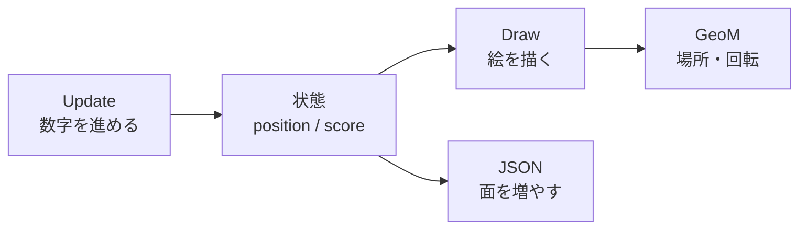
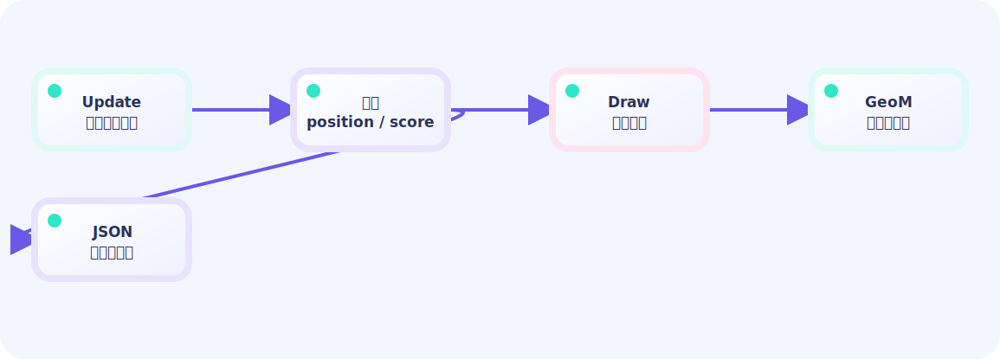

# Ebitengine 学習用語集

この用語集は、Ebi Showcase のコードを読むときに何度も出てくる数字と
Go の書き方を、ゲーム内の例と結び付けるための索引です。まずは LEVEL 01
の `Update` → `Draw` を読み、分からない単語だけをここで引いてください。

## 用語の概念マップ

まずは、ゲームの数字がどの箱を通って画面へ届くかを眺めます。矢印を左から
右へ追うと、`Update` は状態を変え、`Draw` はその状態を絵にする、と分かります。
ステージを増やすときは、ルールをGoに残し、変わる数字をJSONへ移します。





## 1フレームと単位

- **フレーム**: 画面を描き直す1コマ。Ebitengine の `Update` は通常およそ
  60回/秒なので、1コマは約 `1/60` 秒（約16.7ms）です。
- **位置**: 画面の左上を `(0, 0)` とするピクセル座標。画面では下へ行くほど
  `Y` が大きくなります。
- **速度**: 1フレームで動くピクセル数（px/frame）。
- **加速度**: 速度を1フレームごとに変える量（px/frame²）。たとえば
  `vy += 0.42` は、毎コマ下向きの速度を0.42ずつ増やします。

## 角度と三角関数

`math.Sin` と `math.Cos` は度ではなくラジアンを受け取ります。

```go
rad := degrees * math.Pi / 180 // 度 → ラジアン
x := centerX + math.Cos(rad)*radius
y := centerY + math.Sin(rad)*radius
```

1周は `360° = 2π` ラジアン、半周は `180° = π` ラジアンです。

## 方向をそろえる（正規化）

`dx, dy` を同じ方向のまま長さ1にする計算です。距離が0のときは割れない
ので、先に分岐します。

```go
distance := math.Hypot(dx, dy)
if distance > 0 {
    dx /= distance
    dy /= distance
}
```

## 判定の箱

- **AABB**: 左上 `(x, y)` と幅・高さで表す軸に沿った矩形。
- **円衝突**: 中心間距離が半径の合計より小さいかを調べる判定。
- **当たり判定**: 攻撃や弾が相手へ当たる箱・円。
- **食らい判定**: キャラクターが攻撃を受ける箱・円。

見た目が丸でも、最初は矩形で十分なことがあります。大切なのは、記事の
図とコードが同じ判定方法を説明していることです。

## `iota` と状態

Go の定数ブロックで、上から `0, 1, 2 ...` の番号を自動で付ける仕組みです。
状態の名前を数字の代わりに使えるので、`switch` と相性が良い書き方です。

```go
type phase int
const (
    Choose phase = iota // 0: コマンドを選ぶ
    Resolve             // 1: 効果を解決する
    Enemy               // 2: 敵が動く
)
```

## スライスとJSON

`[]Card` のようなスライスは、同じ種類の値を順番に並べる伸び縮みする箱です。
`append` は末尾に追加します。`append([]Card(nil), cards...)` は新しい箱へ
要素をコピーする書き方で、元の箱と同じ配列を共有しません。
すでに使った箱を再利用したいときの `cards = cards[:0]` は、要素数だけを
0にして容量を残す書き方です（デッキの捨て札を空にする場面で使います）。

JSON では、`[]` が順番のある配列、`{}` が名前付きのオブジェクトです。

```json
{"name":"village","walls":[[0,1,1],[0,0,1]]}
```

ゲームのルールをGoに、村や敵の数値をJSONに分けると、同じプログラムで
別のステージを再生できます。

## 変換と色

`GeoM` は絵へ行う変換の設定箱です。中心回転は、中心を原点へ移す→回転・
拡大縮小→画面へ移す、の順に書きます。`Rotate` の角度はラジアンです。

`ColorScale.Scale(r, g, b, a)` は各チャンネルに倍率を掛けます。`a=1` は
元の不透明度、`a=0.5` は半分、`a=0` は透明です。1より大きい色倍率は
白く光るフラッシュになります。

## 参考リンク

- [Go `iota` と定数](https://go.dev/ref/spec#Iota)
- [Ebitengine Game インターフェース](https://ebitengine.org/en/documents/game.html)
- [Ebitengine GeoM](https://pkg.go.dev/github.com/hajimehoshi/ebiten/v2#GeoM)
