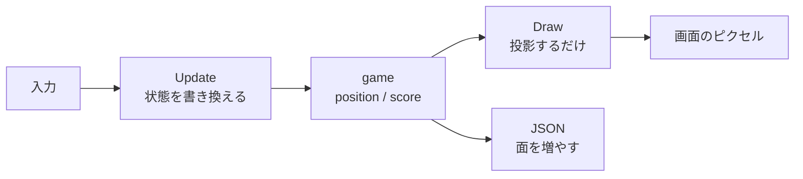
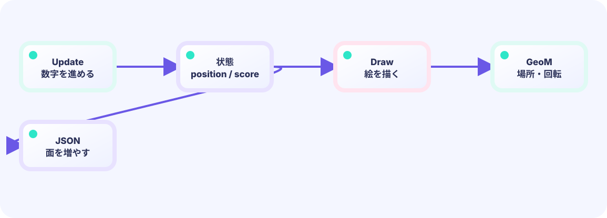

# Ebitengine 学習用語集

この用語集は、Ebi Showcase のコードを読むときに何度も出てくる数字と
Go の書き方を、ゲーム内の例と結び付けるための索引です。まずは LEVEL 01
の `Update` → `Draw` を読み、分からない単語だけをここで引いてください。

## 用語の概念マップ

まずは、ゲームの数字がどの箱を通って画面へ届くかを眺めます。Ebi Showcase では次を何度もくり返します。

1. **`Update`** — 入力を読み、`game`（状態）の数字をすべて進める
2. **`Draw`** — いまの `game` を画面へ投影するだけ。中身は書き換えない
3. **画面は `game` に 1 bit 違わず追従する** — 同じ状態なら同じ絵

矢印を左から右へ追うと、「先にコマの中身を決め、そのコマを描く。描きながら中身を変えない」と分かります。
ステージを増やすときは、ルールを Go の `Update`（やそれが呼ぶ関数）に残し、変わる数字を JSON へ移します。


```mermaid
flowchart LR
  input["入力"] --> update["Update<br/>状態を書き換える"]
  update --> state["game<br/>position / score"]
  state --> draw["Draw<br/>投影するだけ"]
  draw --> pixels["画面のピクセル"]
  state --> data["JSON<br/>面を増やす"]
```



## Update と Draw（公理）

- **Update**: Ebitengine が設定された刻みごとに呼び出すメソッド。1回の呼び出しを本教材では **1 tick（ティック）** と呼ぶ。入力（キー／ポインタ／タッチ）を検知し、スコア・位置・タイマー・勝敗判定など **すべてのゲーム状態の更新** を行う。描画処理は含まない。
- **Draw**: 現在の `game` 構造体のフィールド値を読み取り、図形・文字・スプライトを **画面のピクセルとして描画（投影）する** メソッド。入力の読み取り、状態の書き換え（`score++` など）、乱数消費、スライスの要素変更は行わない。
- **追従**: 画面の描画結果は、直前の `game` 状態、描画用アセット、ビューポートの指定のみから決まる。同一の `game` 状態に対して `Draw` を複数回呼び出しても、描画結果は同一になる。

くわしい最初の説明は LEVEL 01（光る丸をタッチ）です。あとの教材はこれを前提に部品を足します。

## tick・frameと単位

- **tick**: `Update` が1回実行され、ゲーム内の入力検知・位置計算・タイマー・判定が1段階進む論理時間の単位。既定値では通常毎秒およそ60 tickだが、設定によって変更できる。
- **frame**: `Draw` が生成する画面の1コマ（またはスプライトシート内の1コマ）を表す描画単位。描画負荷に応じて `Draw` は遅延またはスキップされる場合があるため、1 tick と 1 frame は必ずしも1対1で対応しない。
- **位置**: 画面の左上を `(0, 0)` とするピクセル座標。画面では下へ行くほど
  `Y` が大きくなります。
- **速度**: 1 tickで動くピクセル数（px/tick）。
- **加速度**: 速度を1 tickごとに変える量（px/tick²）。たとえば
  `vy += 0.42` は、Updateのたびに下向きの速度を0.42ずつ増やします。

## 角度と三角関数

`math.Sin` と `math.Cos` は度ではなくラジアンを受け取ります。

```go
rad := degrees * math.Pi / 180 // 度 → ラジアン
x := centerX + math.Cos(rad)*radius
y := centerY + math.Sin(rad)*radius
```

1周は `360° = 2π` ラジアン、半周は `180° = π` ラジアンです。

## 方向をそろえる（正規化）

`dx, dy` を同じ方向のまま長さ1にする計算です。距離が0のときは割れない
ので、先に分岐します。

```go
distance := math.Hypot(dx, dy)
if distance > 0 {
    dx /= distance
    dy /= distance
}
```

## 判定の箱

- **AABB**: 左上 `(x, y)` と幅・高さで表す軸平行境界ボックス（Axis-Aligned Bounding Box）。
- **円衝突**: 中心間距離が半径の合計以下であるかを調べる幾何判定。
- **当たり判定**: 攻撃や弾が相手へ当たる領域（箱・円）。
- **食らい判定**: キャラクターが攻撃を受ける領域（箱・円）。

見た目が丸いオブジェクトであっても、計算負荷や実装の平易さから軸平行境界ボックス（AABB）で判定する設計は珍しくありません。記事の図とコードが同一の判定機構を説明している状態を保ちます。

## `iota` と状態

Go の定数ブロックで、上から `0, 1, 2 ...` の連続する整数値を自動的に割り当てる識別子です。
状態に名前付きの型を与えて数字の代入を防げるため、`switch` による状態遷移と組み合わせて多用されます。

```go
type phase int
const (
    Choose phase = iota // 0: コマンドを選ぶ
    Resolve             // 1: 効果を解決する
    Enemy               // 2: 敵が動く
)
```

## スライスとJSON

`[]Card` のようなスライスは、同一の型の要素を連続して並べる可変長のデータ構造です。
`append` は末尾に新しい要素を追加します。`append([]Card(nil), cards...)` は新しいスライスへ要素をコピーするイディオムであり、元のスライスと基底配列を共有しません。
すでに確保済みの配列領域を再利用したいときの `cards = cards[:0]` は、要素数（長さ）だけを0にして容量（キャパシティ）を残す指定です（デッキの捨て札を空にする場面などで使用します）。

JSON では、`[]` が順序を持つ配列、`{}` がキーと値の組を持つオブジェクトです。

```json
{"name":"village","walls":[[0,1,1],[0,0,1]]}
```

ゲームの進行規則をGoコードに、ステージや敵のパラメータをJSONデータに分離することで、同一の実行バイナリのまま異なるステージを構成できます。

## 変換と色

`GeoM` は、画像に対して平行移動・回転・拡大縮小を行う2次元のアフィン変換行列です。中心を軸とする回転は、中心座標を原点へ移動する → 回転・拡大縮小を適用する → 画面上の描画位置へ移動する、の順序で指定します。`Rotate` メソッドが受け取る角度の単位はラジアンです。

`ColorScale.Scale(r, g, b, a)` は描画色の各チャンネルに乗算する倍率を指定します。`a=1.0` は元の不透明度を維持し、`a=0.5` は半透明、`a=0.0` は完全透明になります。1.0 を超える色倍率を指定すると、白く光るフラッシュ効果を表現できます。

## 参考リンク

- [Go `iota` と定数](https://go.dev/ref/spec#Iota)
- [Ebitengine Game インターフェース](https://ebitengine.org/en/documents/game.html)
- [Ebitengine GeoM](https://pkg.go.dev/github.com/hajimehoshi/ebiten/v2#GeoM)
